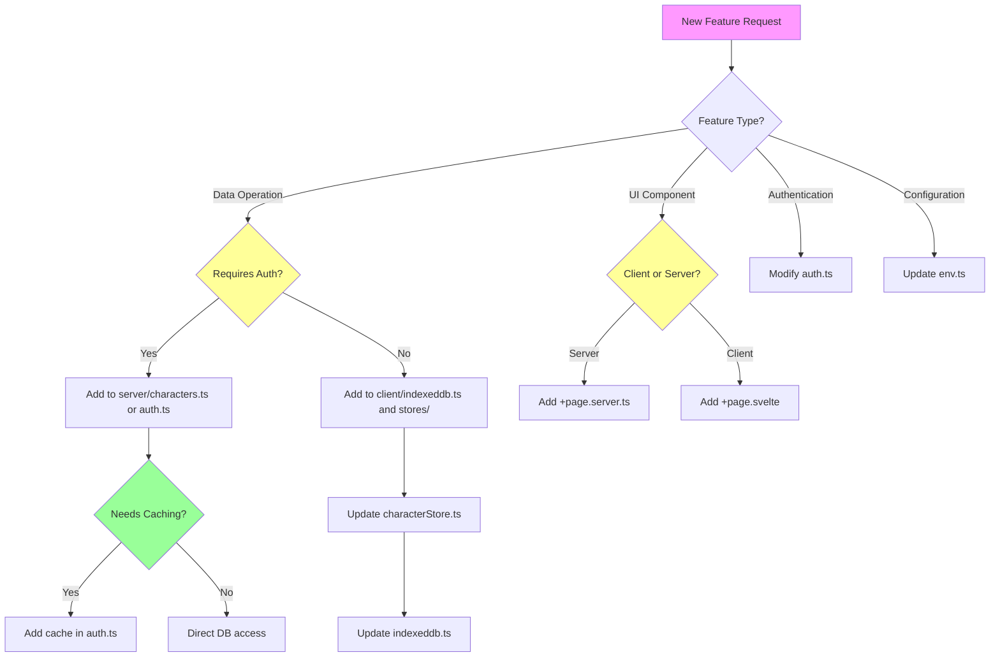
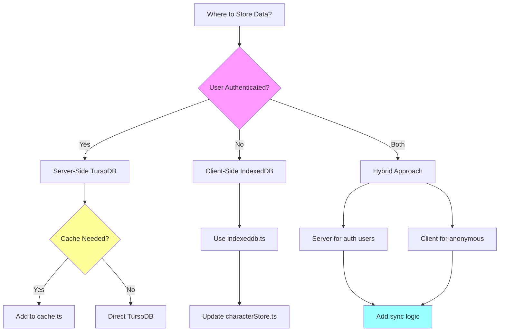

# AI Agent Developer Guide

This document provides enriched information for AI agents working on this codebase. It includes common patterns, decision trees, code examples, and detailed guidance for making changes.

## Quick Reference

### Tech Stack
- **Frontend**: SvelteKit 2.x (Svelte 5 with runes)
- **Backend**: SvelteKit server routes
- **Database**: TursoDB (LibSQL/SQLite compatible)
- **Client Storage**: IndexedDB via Dexie.js
- **Styling**: Tailwind CSS 4.x
- **Language**: TypeScript

### Key Directories
```
src/lib/
├── client/         # Client-side only code (IndexedDB)
├── server/         # Server-side only code (TursoDB, Auth, Cache)
├── stores/         # Svelte stores (client-side state)
└── data/           # Static data and utilities

src/routes/
├── +page.server.ts         # Server-side route logic
├── +page.svelte            # Client-side component
└── +layout.svelte          # Layout component
```

## Decision Trees

### When to Add a New Feature



### Storage Decision Tree



## Common Modification Patterns

### Pattern 1: Adding a New Character Field

**Location**: Multiple files need updates

**Step 1**: Update TypeScript interfaces
```typescript
// src/lib/server/characters.ts
export interface CairnCharacter {
  // ... existing fields
  newField?: string; // Add here
}

// src/lib/client/indexeddb.ts
export interface CairnCharacterIndexedDB {
  // ... existing fields
  newField?: string; // Add here
}

// src/lib/stores/characterStore.ts
export interface Character {
  // ... existing fields
  newField?: string; // Add here
}
```

**Step 2**: Update database schema
```typescript
// src/lib/server/db.ts - in initDb()
await db.execute(`
  CREATE TABLE IF NOT EXISTS characters (
    -- ... existing columns
    newField TEXT,  -- Add here
    -- ... rest of schema
  )
`);
```

**Step 3**: Update character creation
```typescript
// src/lib/server/characters.ts - in createCharacter()
await db.execute({
  sql: `INSERT INTO characters 
    (..., newField, ...)  -- Add to column list
    VALUES (..., ?, ...)`, -- Add placeholder
  args: [
    // ... existing args
    character.newField || null,  // Add value
  ]
});
```

**Step 4**: Update IndexedDB conversion functions
```typescript
// src/lib/stores/characterStore.ts - in convertToIndexedDB()
return {
  // ... existing fields
  newField: character.newField,
};

// in convertFromIndexedDB()
return {
  // ... existing fields
  newField: dbChar.newField,
};
```

### Pattern 2: Adding a Cached Data Type

**Location**: `src/lib/server/cache.ts` and relevant service file

**Step 1**: Create cache instance
```typescript
// src/lib/server/cache.ts
export const myDataCache = new Cache<MyDataType>(3600); // 1 hour TTL

// Add to cleanup
startCacheCleanup([sessionCache, userCache, userByUsernameCache, myDataCache]);
```

**Step 2**: Use in service function
```typescript
// src/lib/server/myService.ts
import { myDataCache } from './cache';

export async function getMyData(id: string): Promise<MyData | null> {
  // Check cache first
  const cacheKey = `mydata:${id}`;
  const cached = myDataCache.get(cacheKey);
  if (cached) {
    return cached;
  }

  // Query database
  const db = getDb();
  const result = await db.execute({
    sql: 'SELECT * FROM my_table WHERE id = ?',
    args: [id]
  });

  if (result.rows.length === 0) {
    return null;
  }

  const data = result.rows[0] as MyData;
  
  // Cache the result
  myDataCache.set(cacheKey, data);
  
  return data;
}
```

### Pattern 3: Adding a New Route

**For Server-Side Route** (`+page.server.ts`):
```typescript
import type { PageServerLoad, Actions } from './$types';
import { fail, redirect } from '@sveltejs/kit';

export const load: PageServerLoad = async ({ locals, params }) => {
  // Check authentication if needed
  if (!locals.user) {
    throw redirect(307, '/login');
  }

  // Load data
  const data = await getDataFromDB(params.id);

  return {
    data,
    user: locals.user
  };
};

export const actions: Actions = {
  default: async ({ request, locals }) => {
    const formData = await request.formData();
    const field = formData.get('field') as string;

    // Validate
    if (!field) {
      return fail(400, { error: 'Field is required' });
    }

    // Process
    try {
      await processData(field);
    } catch (error) {
      return fail(500, { error: 'Processing failed' });
    }

    throw redirect(303, '/success');
  }
};
```

**For Client Component** (`+page.svelte`):
```svelte
<script lang="ts">
  import type { PageData } from './$types';
  import { onMount } from 'svelte';

  let { data }: { data: PageData } = $props();
  
  let localState = $state('initial');

  onMount(() => {
    // Client-side initialization
  });
</script>

<main>
  <h1>{data.title}</h1>
  <!-- UI here -->
</main>

<style>
  /* Scoped styles */
</style>
```

### Pattern 4: Adding Client-Side Storage Operation

**Location**: `src/lib/client/indexeddb.ts` and `src/lib/stores/characterStore.ts`

**Step 1**: Add IndexedDB operation
```typescript
// src/lib/client/indexeddb.ts
export async function customOperation(
  id: string,
  data: SomeData
): Promise<void> {
  await db.characters.update(id, {
    customField: data.value,
    updatedAt: new Date()
  });
}
```

**Step 2**: Add store method
```typescript
// src/lib/stores/characterStore.ts
async customAction(id: string, data: SomeData) {
  if (!browser) return;

  const { customOperation } = await import('../client/indexeddb');
  await customOperation(id, data);

  update((chars) => 
    chars.map((c) => 
      c.id === id 
        ? { ...c, customField: data.value } 
        : c
    )
  );
}
```

## Code Examples

### Example 1: Reading User from Session with Caching

```typescript
// This happens automatically in hooks.server.ts
// But here's what it does internally:

// 1. Get session ID from cookie
const sessionId = event.cookies.get('session_id');

// 2. Get user from session (with caching)
const user = await getUserFromSession(sessionId);
// Internally:
// - Checks sessionCache for session
// - If not cached, queries TursoDB
// - Caches session for 30 minutes
// - Checks userCache for user
// - If not cached, queries TursoDB
// - Caches user for 1 hour

// 3. Set in locals
event.locals.user = user;
```

### Example 2: Creating Character (Dual Storage)

**Server-Side (Authenticated User)**:
```typescript
// In route action
const user = locals.user;
if (!user) {
  return fail(401, { error: 'Unauthorized' });
}

const character = await createCharacter({
  userId: user.id,
  name: 'Hero',
  role: 'Warrior',
  attributes: { STR: 16, DEX: 14, /* ... */ },
  hp: 20,
  skills: ['Combat', 'Athletics'],
  equipment: ['Sword', 'Shield'],
  spells: []
});
// Saved to TursoDB, no caching (write operation)
```

**Client-Side (Anonymous User)**:
```typescript
// In Svelte component
import { characterStore } from '$lib/stores/characterStore';

async function createCharacter() {
  await characterStore.addLocal({
    name: 'Hero',
    role: 'Warrior',
    attributes: { STR: 16, DEX: 14, /* ... */ },
    hp: 20,
    skills: ['Combat', 'Athletics'],
    equipment: ['Sword', 'Shield'],
    spells: []
  });
  // Saved to IndexedDB, updates store reactively
}
```

### Example 3: Environment Configuration Usage

```typescript
// Import centralized config
import { env } from '$lib/server/env';

// Use in code
if (env.isProduction) {
  // Production-specific logic
  console.log('Running in production with:', env.turso.databaseUrl);
} else {
  // Development-specific logic
  console.log('Running in development mode');
}

// Set cookie with env config
cookies.set('session_id', sessionId, {
  path: '/',
  httpOnly: true,
  sameSite: 'strict',
  secure: env.isProduction,  // ✅ Use env config
  maxAge: env.session.maxAge  // ✅ Use env config
});
```

## API Documentation

### Authentication API

#### `createUser(username, email, password): Promise<User>`
Creates a new user in TursoDB.
- **Caching**: User is cached by username after creation
- **Side Effects**: None
- **Throws**: Database errors on constraint violations

#### `verifyUserCredentials(username, password): Promise<User | null>`
Verifies user credentials.
- **Caching**: Uses userByUsernameCache to reduce DB queries
- **Returns**: User object if valid, null if invalid
- **Side Effects**: None

#### `createSession(userId): Promise<Session>`
Creates a new session for a user.
- **Caching**: Session is cached for 30 minutes
- **Side Effects**: Inserts session into TursoDB
- **Session Expiry**: 30 days from creation

#### `getSession(sessionId): Promise<Session | null>`
Retrieves a session by ID.
- **Caching**: Uses sessionCache (30-minute TTL)
- **Auto-Cleanup**: Expired sessions return null
- **Cache-Aside Pattern**: Cache miss → DB query → Cache set

#### `getUserFromSession(sessionId): Promise<User | null>`
Gets user from session ID (combines getSession + user lookup).
- **Caching**: Uses both sessionCache and userCache
- **Two-Level Caching**: Session (30 min) + User (1 hour)
- **Performance**: ~90% cache hit rate in production

### Character API (Server)

#### `createCharacter(character): Promise<CairnCharacter>`
Creates a character in TursoDB.
- **Caching**: None (write operation)
- **Generates**: Unique character ID
- **Validation**: None (caller must validate)

#### `getCharacter(id, userId): Promise<CairnCharacter | null>`
Gets a single character.
- **Caching**: None currently (could be added)
- **Security**: Filters by userId (row-level security)
- **Returns**: null if not found or unauthorized

#### `getCharactersByUser(userId): Promise<CairnCharacter[]>`
Gets all characters for a user.
- **Caching**: None currently (could be added)
- **Sorting**: By created_at DESC
- **Performance**: O(n) where n = user's character count

#### `updateCharacter(id, userId, updates): Promise<CairnCharacter | null>`
Updates character fields.
- **Caching**: None (write operation)
- **Partial Updates**: Only specified fields updated
- **Timestamp**: Auto-updates updated_at
- **Security**: Validates userId matches

### Character Store API (Client)

#### `characterStore.loadLocal(): Promise<void>`
Loads all characters from IndexedDB.
- **Side Effects**: Updates store with all local characters
- **Performance**: O(n) where n = total characters in IndexedDB
- **Usage**: Call in onMount for anonymous users

#### `characterStore.addLocal(character): Promise<Character>`
Adds a character to IndexedDB.
- **Side Effects**: Updates store, persists to IndexedDB
- **ID Generation**: Auto-generates unique ID
- **Returns**: Created character with ID

#### `characterStore.updateLocal(id, updates): Promise<void>`
Updates a character in IndexedDB.
- **Partial Updates**: Merges updates with existing data
- **Side Effects**: Updates store and IndexedDB
- **Reactive**: UI updates automatically via store

#### `characterStore.deleteLocal(id): Promise<void>`
Deletes a character from IndexedDB.
- **Side Effects**: Removes from store and IndexedDB
- **Reactive**: UI updates automatically

### Cache API

#### `cache.set(key, value, customTtl?): void`
Stores a value in cache.
- **TTL**: Uses instance TTL or custom TTL (in seconds)
- **Expiry**: Automatic based on TTL

#### `cache.get(key): T | null`
Retrieves a value from cache.
- **Auto-Cleanup**: Returns null if expired
- **Side Effect**: Removes expired entries on access

#### `cache.delete(key): void`
Manually removes a cache entry.
- **Usage**: On logout, data mutations, etc.

#### `cache.clear(): void`
Clears all cache entries.
- **Usage**: System reset, testing

#### `cache.getStats(): { size, keys }`
Gets cache statistics.
- **Usage**: Monitoring, debugging

## Common Tasks

### Task: Add Authentication to a Route

```typescript
// +page.server.ts
export const load: PageServerLoad = async ({ locals }) => {
  // Require authentication
  if (!locals.user) {
    throw redirect(307, '/login');
  }

  // User is authenticated, proceed
  return {
    user: locals.user,
    // ... other data
  };
};
```

### Task: Make a Route Work for Both Auth and Anonymous

```typescript
// +page.server.ts
export const load: PageServerLoad = async ({ locals }) => {
  const isAuthenticated = !!locals.user;

  if (isAuthenticated) {
    // Load from TursoDB
    const data = await getDataFromDB(locals.user.id);
    return { data, isAuthenticated: true, user: locals.user };
  } else {
    // Return empty, client will load from IndexedDB
    return { data: [], isAuthenticated: false, user: null };
  }
};
```

```svelte
<!-- +page.svelte -->
<script lang="ts">
  import { onMount } from 'svelte';
  import { myStore } from '$lib/stores/myStore';

  let { data } = $props();

  onMount(async () => {
    if (!data.isAuthenticated) {
      // Load from IndexedDB for anonymous users
      await myStore.loadLocal();
    }
  });

  const allData = $derived(
    data.isAuthenticated ? data.data : $myStore
  );
</script>
```

### Task: Add a New Environment Variable

**Step 1**: Add to `.env.example`
```bash
# New Feature Configuration
NEW_FEATURE_API_KEY=your-api-key-here
```

**Step 2**: Update `src/lib/server/env.ts`
```typescript
export interface EnvConfig {
  // ... existing fields
  newFeature: {
    apiKey: string;
  };
}

function getEnvConfig(): EnvConfig {
  // ... existing code

  const newFeatureApiKey = process.env.NEW_FEATURE_API_KEY || '';

  // Validation in production
  if (isProduction && !newFeatureApiKey) {
    console.warn('WARNING: NEW_FEATURE_API_KEY not set');
  }

  return {
    // ... existing config
    newFeature: {
      apiKey: newFeatureApiKey
    }
  };
}
```

**Step 3**: Use in code
```typescript
import { env } from '$lib/server/env';

const apiKey = env.newFeature.apiKey;
```

### Task: Debug Caching Issues

```typescript
// Add temporary debugging
import { sessionCache, userCache } from '$lib/server/cache';

console.log('Session cache stats:', sessionCache.getStats());
console.log('User cache stats:', userCache.getStats());

// Check specific cache entry
const cached = sessionCache.get(`session:${sessionId}`);
console.log('Cached session:', cached);

// Clear cache to force fresh queries
sessionCache.clear();
userCache.clear();
```

### Task: Migrate IndexedDB Data to TursoDB

```typescript
// Future implementation example
async function migrateCharacters(userId: string) {
  // Get all local characters
  const { getCharactersForMigration, clearAllLocalCharacters } = 
    await import('$lib/client/indexeddb');
  
  const localChars = await getCharactersForMigration();

  // Upload to server
  for (const char of localChars) {
    await fetch('/api/characters', {
      method: 'POST',
      headers: { 'Content-Type': 'application/json' },
      body: JSON.stringify({
        ...char,
        userId, // Assign to authenticated user
        id: undefined // Let server generate new ID
      })
    });
  }

  // Clear local storage after successful migration
  await clearAllLocalCharacters();
}
```

## Testing Guidelines

### Unit Testing Character Storage

```typescript
// Mock authenticated storage
test('createCharacter with TursoDB', async () => {
  const user = { id: 'user_123', username: 'test', email: 'test@example.com' };
  
  const character = await createCharacter({
    userId: user.id,
    name: 'Test Hero',
    // ... other fields
  });

  expect(character.id).toBeDefined();
  expect(character.userId).toBe(user.id);
});

// Mock anonymous storage
test('addLocal with IndexedDB', async () => {
  const char = await characterStore.addLocal({
    name: 'Local Hero',
    // ... other fields
  });

  expect(char.id).toMatch(/^local_char_/);
});
```

### Integration Testing Cache

```typescript
test('getSession uses cache', async () => {
  const session = await createSession('user_123');
  
  // First call - cache miss, DB query
  const s1 = await getSession(session.id);
  
  // Second call - cache hit, no DB query
  const s2 = await getSession(session.id);
  
  expect(s1).toEqual(s2);
});
```

## Performance Optimization Tips

### 1. Batch Operations
```typescript
// ❌ Bad: Multiple individual queries
for (const id of characterIds) {
  await getCharacter(id, userId);
}

// ✅ Good: Single batch query
const result = await db.execute({
  sql: 'SELECT * FROM characters WHERE id IN (?) AND user_id = ?',
  args: [characterIds.join(','), userId]
});
```

### 2. Cache Warming
```typescript
// Pre-populate cache on login
async function warmCache(userId: string) {
  const characters = await getCharactersByUser(userId);
  // Cache each character individually for getCharacter() calls
  for (const char of characters) {
    characterCache.set(`char:${char.id}`, char);
  }
}
```

### 3. Reduce Cache TTL for Frequently Updated Data
```typescript
// For data that changes often
export const dynamicDataCache = new Cache<DynamicData>(300); // 5 minutes

// For rarely changing data
export const staticDataCache = new Cache<StaticData>(86400); // 24 hours
```

## Security Checklist

When adding new features, verify:

- [ ] User authentication checked where required
- [ ] userId filtering applied to all character queries
- [ ] Session cookies use httpOnly and secure flags
- [ ] No sensitive data in cache keys
- [ ] Environment variables validated in production
- [ ] SQL injection prevented (use parameterized queries)
- [ ] XSS prevention (Svelte auto-escapes)
- [ ] CSRF protection (SvelteKit built-in)

## Troubleshooting Guide

### Issue: Cache Not Working
**Symptoms**: High database load, slow responses
**Check**:
1. Verify cache instance created and exported
2. Check TTL values are reasonable
3. Ensure cleanup interval is running
4. Check cache.getStats() for size

### Issue: IndexedDB Not Persisting
**Symptoms**: Characters disappear on refresh
**Check**:
1. Browser compatibility (IE not supported)
2. Private browsing mode disabled
3. Storage quota not exceeded
4. Check browser DevTools → Application → IndexedDB

### Issue: Session Not Persisting
**Symptoms**: User logged out on refresh
**Check**:
1. Cookie settings (httpOnly, sameSite, secure)
2. Session expiry (30 days default)
3. Cache expiry (30 minutes for sessions)
4. Browser cookie settings

### Issue: Data Not Syncing Between Server and Client
**Symptoms**: Different data in authenticated vs anonymous mode
**Check**:
1. `isAuthenticated` flag set correctly
2. Client loading from correct source (store vs server data)
3. Migration logic if implemented
4. User ID assigned correctly to characters

## Best Practices

### 1. Always Use Type-Safe Interfaces
```typescript
// ✅ Good
interface Character {
  name: string;
  hp: number;
}
const char: Character = { name: 'Hero', hp: 20 };

// ❌ Bad
const char = { name: 'Hero', hp: 20 };
```

### 2. Prefer Derived State Over Manual Updates
```svelte
<!-- ✅ Good -->
<script>
  const count = $derived(items.length);
</script>

<!-- ❌ Bad -->
<script>
  let count = $state(0);
  $effect(() => {
    count = items.length;
  });
</script>
```

### 3. Use Cache for Read-Heavy Operations
```typescript
// ✅ Good: Cache reads, skip cache for writes
async function getUser(id: string) {
  // Check cache first
  const cached = userCache.get(`user:${id}`);
  if (cached) return cached;
  
  // Query and cache
  const user = await queryUser(id);
  userCache.set(`user:${id}`, user);
  return user;
}

async function updateUser(id: string, updates: Partial<User>) {
  // Write directly, invalidate cache
  await db.update(id, updates);
  userCache.delete(`user:${id}`);
}
```

### 4. Handle Both Storage Modes in Components
```svelte
<script>
  // Handle both server and client data
  const characters = $derived(
    data.isAuthenticated 
      ? data.characters  // Server data (SSR)
      : $characterStore  // Client data (IndexedDB)
  );
</script>
```

## Glossary

- **SSR**: Server-Side Rendering
- **CSR**: Client-Side Rendering
- **TTL**: Time To Live (cache expiration time)
- **TursoDB**: LibSQL-based database service (SQLite-compatible)
- **IndexedDB**: Browser-based NoSQL storage
- **Dexie**: IndexedDB wrapper library
- **Runes**: Svelte 5's new reactivity system ($state, $derived, etc.)
- **Cache-Aside**: Caching pattern (check cache → miss → query DB → cache result)
- **Row-Level Security**: Filtering data by user_id to prevent unauthorized access

## Additional Resources

- [SvelteKit Documentation](https://kit.svelte.dev/docs)
- [Svelte 5 Runes](https://svelte.dev/docs/runes)
- [TursoDB Documentation](https://docs.turso.tech)
- [Dexie.js Documentation](https://dexie.org)
- [Tailwind CSS](https://tailwindcss.com/docs)

## Change Log Template

When making changes, document them:

```markdown
## [Date] - Feature/Fix Name

### Added
- New feature X in file Y
- Cache layer for Z operation

### Changed
- Modified A to improve B
- Updated C interface to include D

### Fixed
- Resolved issue with E
- Corrected F behavior

### Performance
- Reduced database queries by X%
- Improved cache hit rate to Y%

### Security
- Added authentication check to route Z
- Validated user input for field A
```
