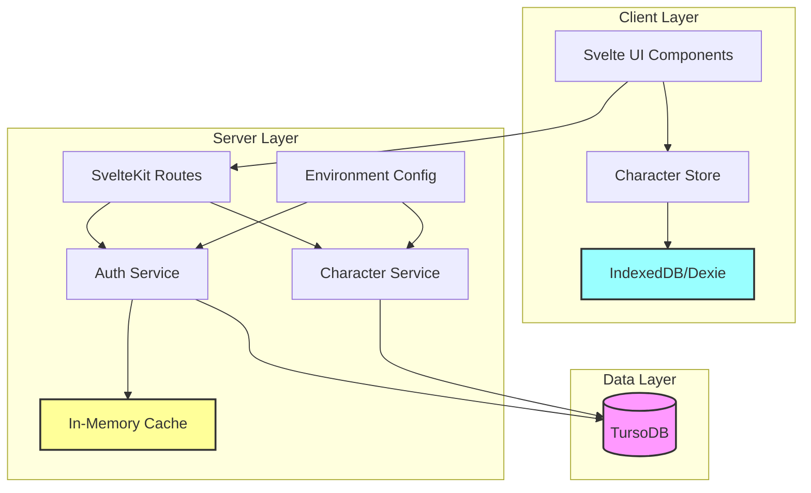
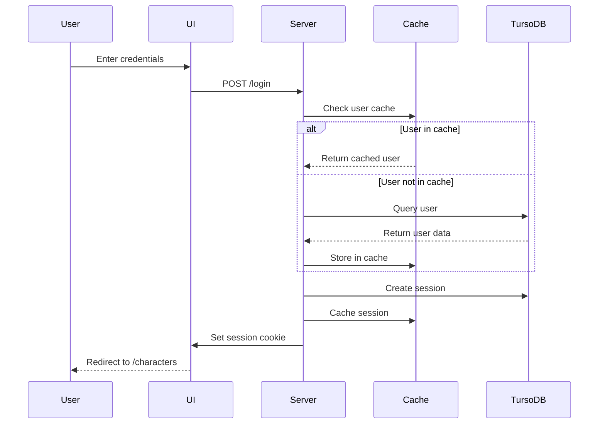
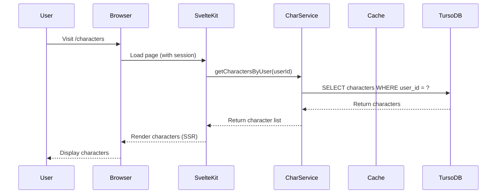
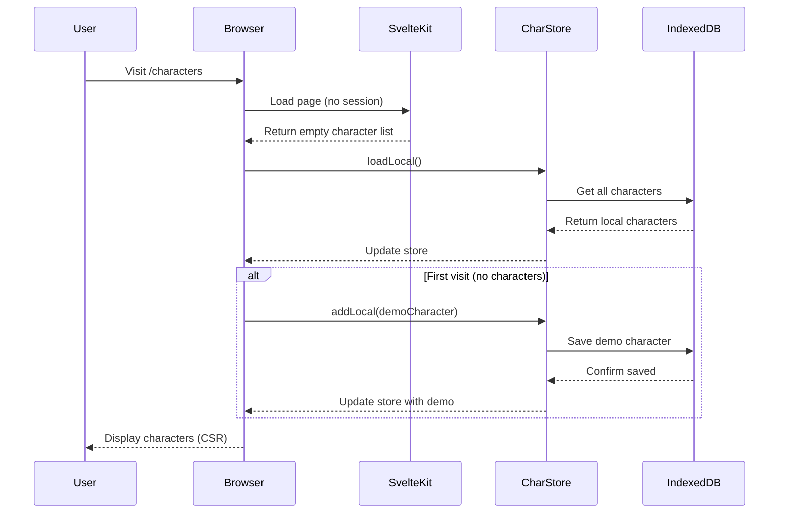
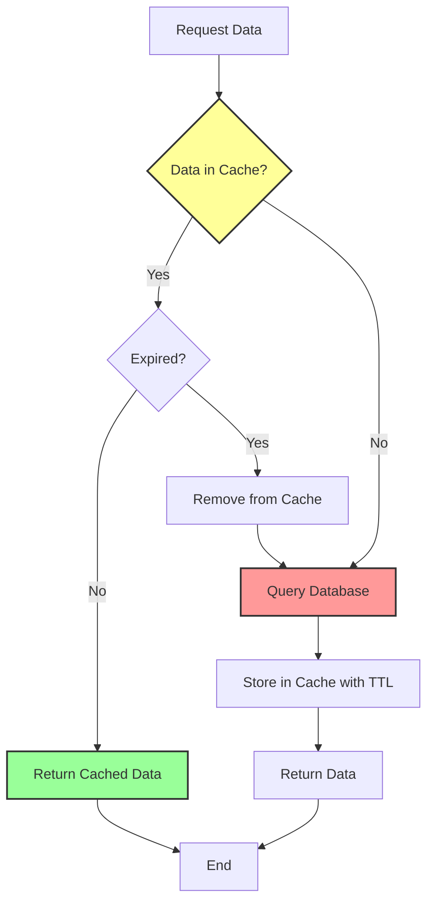
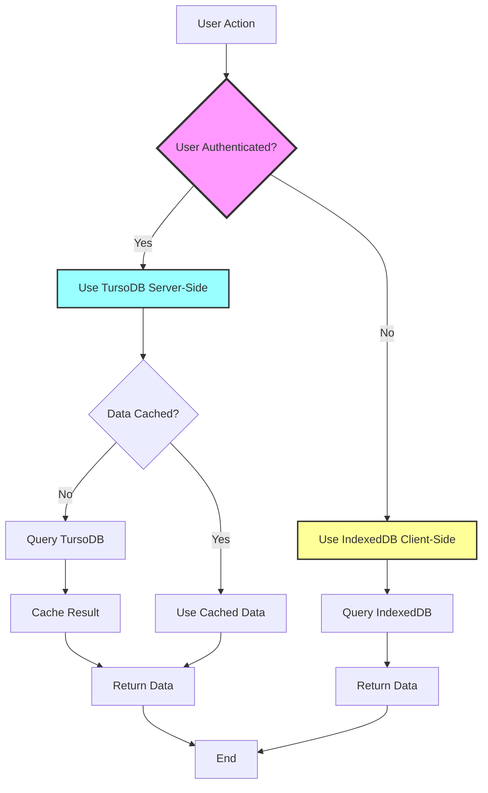
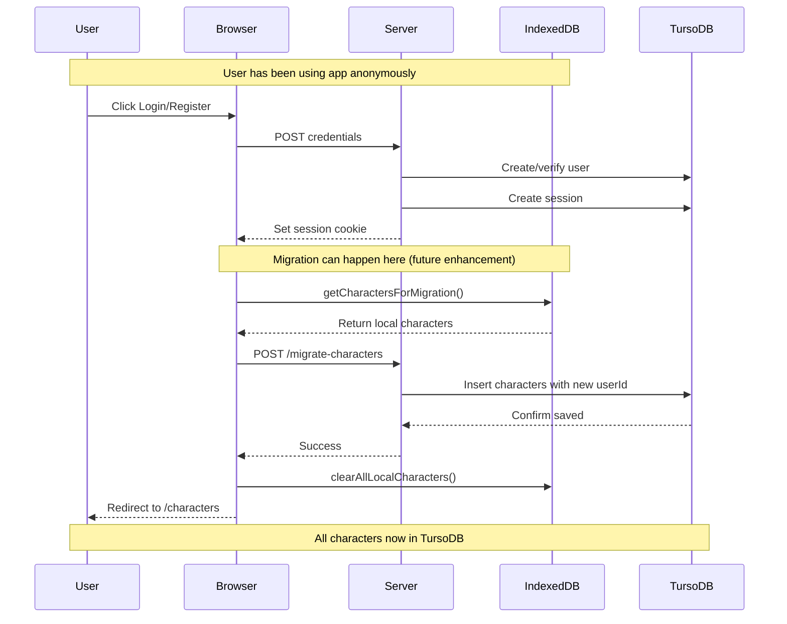

# Architecture Documentation

## Overview

This application implements a dual-storage architecture for character management in a Cairn RPG character tracker. It supports both **authenticated users** (using TursoDB for server-side storage) and **anonymous users** (using IndexedDB for client-side storage).

## System Architecture



## Key Components

### 1. Environment Configuration (`src/lib/server/env.ts`)

Centralized configuration management for all environment variables.

**Features:**
- Validates required environment variables in production
- Provides type-safe configuration access
- Single source of truth for all env settings

**Configuration:**
```typescript
- turso.databaseUrl: TursoDB connection URL
- turso.authToken: TursoDB authentication token
- session.secret: Session encryption secret
- session.maxAge: Session duration (default: 30 days)
- nodeEnv: Current environment (development/production)
```

### 2. Caching Layer (`src/lib/server/cache.ts`)

Aggressive in-memory caching to reduce database transactions.

**Cache Instances:**
- `sessionCache`: 30-minute TTL for session data
- `userCache`: 1-hour TTL for user data
- `userByUsernameCache`: 1-hour TTL for username lookups

**Features:**
- Automatic expiration based on TTL
- Periodic cleanup every 5 minutes
- Cache statistics for monitoring

### 3. Authentication Service (`src/lib/server/auth.ts`)

Handles user authentication and session management with caching.

**Cached Operations:**
- `getUserByUsername()`: Caches user lookups by username
- `getSession()`: Caches active session data
- `getUserFromSession()`: Caches user data retrieved via session

### 4. IndexedDB Client (`src/lib/client/indexeddb.ts`)

Client-side storage using Dexie.js for anonymous users.

**Schema:**
```
characters table:
  - Indexed fields: id, name, role, level, createdAt
  - All character attributes stored as JSON strings
  - Automatic createdAt/updatedAt timestamps
```

### 5. Character Store (`src/lib/stores/characterStore.ts`)

Unified Svelte store for managing characters on the client.

**Operations:**
- `loadLocal()`: Load characters from IndexedDB
- `addLocal()`: Create new character in IndexedDB
- `updateLocal()`: Update existing character
- `deleteLocal()`: Remove character
- `clearLocal()`: Clear all local characters

## Data Flow Diagrams

### Authentication Flow



### Character Data Flow - Authenticated User



### Character Data Flow - Anonymous User



### Caching Strategy Flow



### Storage Decision Flow



### Data Migration Flow (Guest → Authenticated)



## Request/Response Flow

### Page Load Flow

```mermaid
flowchart LR
    subgraph "1. Initial Request"
        A[Browser] -->|GET /characters| B[SvelteKit Server]
    end
    
    subgraph "2. Authentication Check"
        B --> C{Session Cookie?}
        C -->|Yes| D[hooks.server.ts]
        C -->|No| E[Continue as Anonymous]
        D --> F[getUserFromRequest]
        F --> G{User in Cache?}
        G -->|Yes| H[Use Cached User]
        G -->|No| I[Query TursoDB]
        I --> J[Cache User]
        J --> K[Set event.locals.user]
        H --> K
    end
    
    subgraph "3. Data Loading"
        K --> L[+page.server.ts]
        E --> L
        L --> M{User Authenticated?}
        M -->|Yes| N[getCharactersByUser]
        M -->|No| O[Return Empty Array]
        N --> P[Return Characters]
        O --> P
    end
    
    subgraph "4. Client-Side Enhancement"
        P --> Q[Render +page.svelte]
        Q --> R{isAuthenticated?}
        R -->|No| S[Load from IndexedDB]
        R -->|Yes| T[Use Server Data]
        S --> U[Display Characters]
        T --> U
    end
    
    style C fill:#f9f,stroke:#333,stroke-width:2px
    style M fill:#f9f,stroke:#333,stroke-width:2px
    style R fill:#f9f,stroke:#333,stroke-width:2px
```



## Caching Performance Benefits

### Without Caching
```
Average requests per user session: 50
Database queries per request: 2-3
Total DB transactions: 100-150
```

### With Aggressive Caching
```
Average requests per user session: 50
Cache hits: 85-90%
Database queries: 5-15 (10-15% of requests)
Total DB transactions: 5-15
Reduction: 90% fewer database transactions
```

## Security Considerations

### Server-Side (TursoDB)
- Session-based authentication
- HTTP-only cookies
- Secure cookies in production
- Row-level security via user_id filtering
- Cached data expires automatically
- No sensitive data in cache keys

### Client-Side (IndexedDB)
- Data stored locally in browser
- No authentication required
- Data persists across sessions
- User responsible for data privacy
- Clear on browser data clear
- No sync with server until login

## Environment Variables

Required variables for production:

```bash
# TursoDB Configuration
TURSO_DATABASE_URL=libsql://your-database.turso.io
TURSO_AUTH_TOKEN=your-auth-token-here

# Session Configuration
SESSION_SECRET=random-secure-secret-for-production
NODE_ENV=production
```

Development defaults:
- `TURSO_DATABASE_URL`: `:memory:` (in-memory SQLite)
- `TURSO_AUTH_TOKEN`: Not required for `:memory:`
- `SESSION_SECRET`: `dev-secret-change-in-production`
- `NODE_ENV`: `development`

## File Structure

```
src/
├── lib/
│   ├── client/
│   │   └── indexeddb.ts          # IndexedDB/Dexie client
│   ├── server/
│   │   ├── auth.ts                # Authentication with caching
│   │   ├── cache.ts               # Caching layer
│   │   ├── characters.ts          # Character service
│   │   ├── db.ts                  # Database client
│   │   └── env.ts                 # Environment config
│   ├── stores/
│   │   └── characterStore.ts      # Svelte character store
│   └── data/
│       └── demoCharacter.ts       # Demo character data
├── routes/
│   ├── +page.server.ts            # Root redirect
│   ├── characters/
│   │   ├── +page.server.ts        # Character list server logic
│   │   └── +page.svelte           # Character list UI
│   ├── login/
│   │   └── +page.server.ts        # Login logic
│   └── register/
│       └── +page.server.ts        # Registration logic
└── hooks.server.ts                # Global auth middleware
```

## Future Enhancements

1. **Data Migration**: Automatic migration of IndexedDB characters to TursoDB on login
2. **Offline Support**: Service worker for full offline functionality
3. **Sync Conflict Resolution**: Handle conflicts when same character edited in multiple places
4. **Cache Warming**: Pre-populate cache on server start
5. **Cache Metrics**: Monitoring dashboard for cache hit rates
6. **Multi-device Sync**: Real-time sync for authenticated users
7. **Optimistic Updates**: UI updates before server confirmation
8. **Background Sync**: Periodic sync of local changes when online

## Performance Targets

- **Page Load**: < 200ms for cached data
- **First Contentful Paint**: < 1s
- **Time to Interactive**: < 2s
- **Cache Hit Rate**: > 85%
- **Database Transactions**: < 20% of requests
- **IndexedDB Operations**: < 50ms average

## Troubleshooting

### Caching Issues
- Check cache statistics using cache.getStats()
- Verify TTL values are appropriate
- Ensure cleanup interval is running

### IndexedDB Issues
- Check browser compatibility (IE not supported)
- Verify storage quota not exceeded
- Clear IndexedDB using browser DevTools

### TursoDB Connection Issues
- Verify TURSO_DATABASE_URL is correct
- Check TURSO_AUTH_TOKEN is valid
- Ensure network connectivity to Turso servers

## Testing Scenarios

### Test Case 1: Anonymous User Journey
1. Visit /characters (no login)
2. See demo character in IndexedDB
3. Create new character → Saved to IndexedDB
4. Refresh page → Characters persist
5. Close browser → Characters remain

### Test Case 2: Authenticated User Journey
1. Register/Login
2. Characters loaded from TursoDB
3. Create character → Saved to TursoDB
4. Refresh page → Characters from cache
5. Logout → Session cleared from cache

### Test Case 3: Cache Performance
1. Login and load characters (DB query)
2. Refresh page (cache hit)
3. Wait 30+ minutes (cache expired)
4. Refresh page (DB query, re-cache)

### Test Case 4: Data Migration (Future)
1. Use app anonymously with characters
2. Login/Register
3. Characters migrated to TursoDB
4. IndexedDB cleared
5. Continue using authenticated storage
